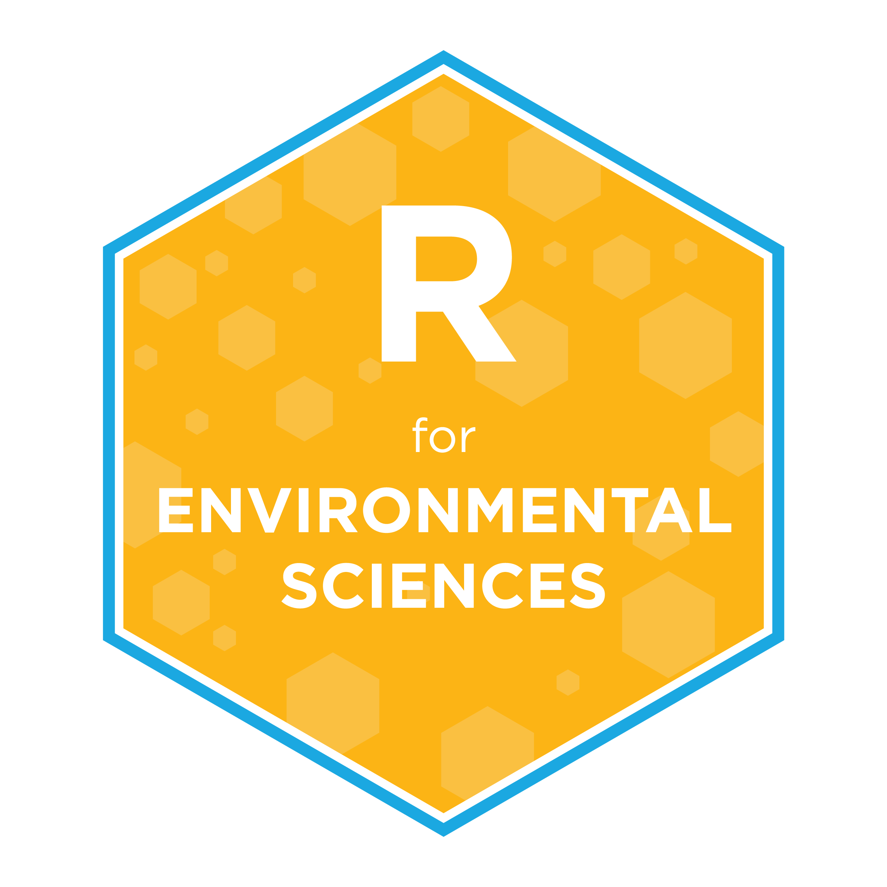

 
 
 

## Welcome to the Public Site for the University of Manitoba's **R for Environmental Sciences** (ENVR 4000 / GEOG 7010)

This course is usually taught on the Fall semester and it is cross listed as ENVR 4000 / GEOG 7010 catering to both undergraduate and graduate students in environmental sciences and related disciplines

For more information contact **Jose Luis Rodriguez Gil**

### Course description

R has established itself as the go-to tool for statistics and data analysis in many fields, and environmental research is not immune to this trend. Whether you are about to enter a job market increasingly driven by big data and the need to make sense of it, or a graduate student looking for efficient and reproducible ways to analyze your data, being familiar with R and how to properly use it will make your future so much easier.

The aim of this course is to familiarize students with R and a number of support tools that will allow them to apply data science and statistical principles more effectively and efficiently to their data. Only basic knowledge of statistics is required because the focus is on R. The course uses RStudio and the Tidyverse to guide students through the process from data collection, including good practices for data organization, to reporting, with an emphasis on transparency, reproducibility, and trustworthy interpretation. Projectoriented workflows, functional programming, version control using Git and GitHub, Quarto, and responsible use of AI-assisted tools will also be introduced.

Although this is not an AI-based course, AI tools are now part of the working environment in which data analysis takes place. These tools can generate code, explanations, visualizations, and draft text, but their usefulness depends on the analyst’s ability to evaluate outputs against the data, documentation, and scientific question. The project-oriented workflows, Markdown/Quarto documents, and version-control practices taught in this course remain central to transparent open-data and open-science work, while also helping make AI-assisted analysis easier to inspect and reproduce. Where AI-assisted work is permitted, R, Quarto, and GitHub provide a paper trail of what was attempted, checked, revised, and retained. The course remains focused on students developing their own ability to reason with and apply R and related tools.

### Learning objectives

By the end of this course, students should be able to:

• plan a data collection and recording strategy that facilitates computational analysis, maximizes reproducibility and shareability, and minimizes non-traceable errors and data loss;
• conduct data cleanup, preparation, analysis, visualization, and reporting in a reproducible, shareable workflow using R and RStudio;
• use project-oriented workflows and version-control approaches in data analysis projects;
• evaluate code, explanations, visualizations, and analytical suggestions—including AI-assisted outputs— against documentation, data, and scientific reasoning; and
• locate and evaluate trustworthy, current sources of help for R and apply those resources to solve practical problems.
